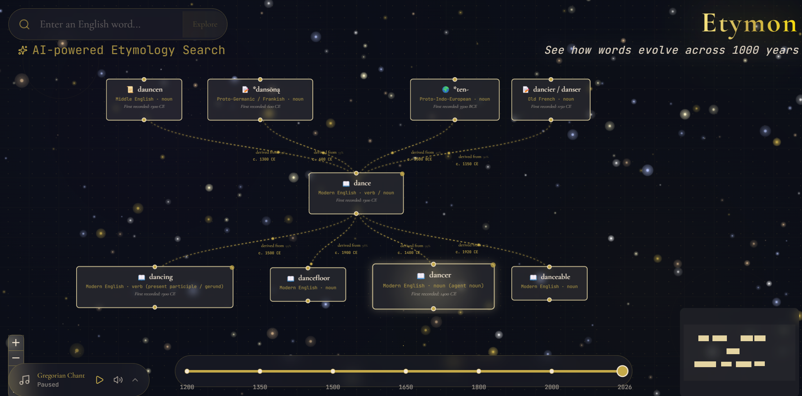
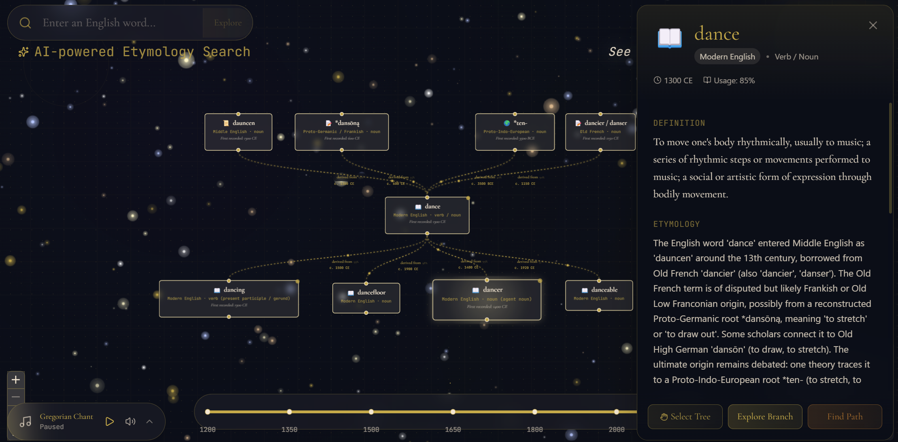

# Etymon — An Interactive Etymology Tree Explorer

  
  

  
  
  
  
  

  
  
  
  
  
  

  
  
  
  

  

  <i>See how words evolve across 1000 years</i>

---

## About

**Etymon** is an immersive, AI-powered platform that transforms the history of language into a living, breathing visual experience. Every word carries the echoes of ancient tongues—Latin whispers, Greek philosophy, Proto-Germanic roots buried deep in time. This project was born from a fascination with etymology and a desire to make the invisible threads connecting language visible, touchable, and beautiful.

At its heart, Etymon offers an **infinite canvas** where English words bloom into glowing, branching trees. Each node pulses with life; each connection flows like ink along gilded bezier curves. Particles drift along ancestral pathways, tracing the direction of linguistic inheritance. Behind it all, a twinkling nebula drifts beneath a soundtrack of Gregorian chant. Feel the echoes of time and enjoy your journey! 

  

---

## Features

### AI-Powered Word Exploration
Search for any English word. Etymon queries **Claude** via a structured AI pipeline, caches the response to a cloud database, and renders the word as a radiant node containing:

- **Definition** and part of speech
- **Language** and historical era
- **Etymology** narrative
- **First recorded usage** (year)
- **Ancestors** — the ancient words it descended from
- **Descendants** — modern words that evolved from it

As you continue exploring related words, your **etymological family tree grows** organically across the infinite canvas.

### Intuitive Interactions
- **Pan & Zoom** — navigate the boundless canvas freely
- **Hover** — preview quick definitions
- **Click any node** — reveal a detailed slide-out panel with full etymology, related words, and metadata
- **Explore Branch** — instantly expand a word's descendants currently stored in the database
- **Find Shortest Path** — select any two words in the family tree, and a highlighted route appears with directional arrows tracing the exact chain of inheritance

### Connected Tree Selection
Click the **"Select Tree"** button to highlight an entire etymological family. **Drag the connected component anywhere** on the canvas.

### Time Travel Slider
Powered by **D3.js**, the timeline slider spans from **1200 AD to the present**. As you scrub through history, word spellings **morph gradually**, reflecting their historical forms across centuries.

### Visual & Sensory Design
| Element | Description |
|---------|-------------|
| **Glowing Nodes** | Color-coded by language era (gold, copper, parchment) |
| **Bezier Edges** | Smooth, flowing curves with directional particles |
| **Scribble Effect** | New AI-generated words fade in as if written by quill |
| **Nebula Background** | Floating, multi-layered particle system with twinkling dynamics and parallax depth |
| **Gregorian Soundscape** | Custom audio player with medieval chant to deepen immersion |
| **Spring Physics** | Smooth animations throughout every interaction |

---

## Tech Stack
| Layer | Technologies |
|-------|--------------|
| **Frontend** | Next.js 14 (App Router), TypeScript (& XML), React Flow, Tailwind CSS, Framer Motion |
| **State** | Zustand (canvas viewport, tree state, API coordination) |
| **AI** | Claude (Anthropic), Vercel AI SDK, Zod schema validation |
| **Database** | PostgreSQL (Neon.tech), Prisma ORM |
| **Algorithms** | Modified Dijkstra (shortest path), BFS (connected components) |
| **Visualization** | D3.js (time slider), Canvas API (nebula), SVG, Lucide-React (icons) |
| **Deployment** | Vercel |

---

